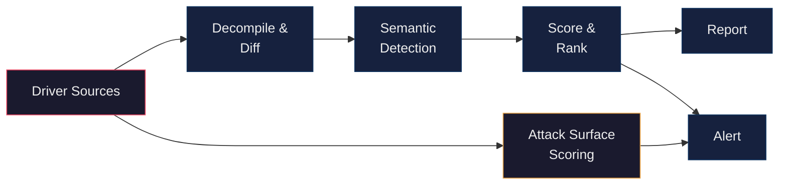

<h1 align="center">Ahmad Abdillah</h1>

  <em>Windows kernel driver security research and tooling</em>

  
  

---

I reverse Windows kernel drivers and study how vendors patch security bugs. A lot of driver updates ship quietly with no CVE or advisory, and the real fixes — use-after-free, missing bounds checks, IOCTL validation — get buried under hundreds of cosmetic changes. Reviewing a single driver update manually takes 4 to 12 hours, so I built tooling to do it at scale.

I'm still learning and improving these tools as I go.

### How It Works

Drivers get picked up from public sources, decompiled with Ghidra, diffed against prior builds, run through semantic detection rules, scored, and flagged for review. In parallel, every incoming driver is scored for attack surface exposure using DriverAtlas — high-risk drivers get flagged immediately, before patch analysis even finishes.

### Projects

| | |
|---|---|
| [**KernelSight**](https://splintersfury.github.io/KernelSight/) | Knowledge base of Windows kernel driver exploitation techniques and attack surfaces. 28 case studies grounded in real CVEs with driver names, build numbers, and PoC references. |
| [**AutoPiff**](https://github.com/splintersfury/AutoPiff) | Semantic analysis engine for detecting vulnerability fixes in driver patches. 58 YAML rules across 22 categories, Ghidra decompilation, reachability tracing, scoring, and DriverAtlas triage. |
| [**DriverAtlas**](https://github.com/splintersfury/DriverAtlas) | Structural analysis toolkit for Windows kernel drivers. Fingerprints frameworks, scores attack surface exposure (22 weighted rules, 0–15 scale), and hunts for high-risk drivers via VirusTotal Intelligence. |
| [**driver_analyzer**](https://github.com/splintersfury/driver_analyzer) | Production pipeline that runs AutoPiff at scale. Karton + MWDB + Ghidra + MinIO, with dashboards, alerting, and driver monitoring. |
| [**API_Calls-Hashes**](https://github.com/splintersfury/API_Calls-Hashes) | Windows API call hash reference for malware analysis. |

### What the Rules Detect

| Category | What It Looks For |
|----------|-------------------|
| Use-After-Free | `ExFreePool` followed by pointer nullification |
| Bounds Checks | Length validation added before `memcpy` / `RtlCopyMemory` |
| User/Kernel Boundary | `ProbeForRead` / `ProbeForWrite` additions |
| Integer Overflow | Safe math helpers: `RtlULongAdd`, `RtlSizeTMult` |
| Race Conditions | Interlocked operations, lock acquisition changes |
| IOCTL Hardening | Input validation in dispatch handlers |
| Pool Corruption | Pool tag/type changes, NX pool migration |
| Privilege Checks | `SeSinglePrivilegeCheck` / token validation |

### Tech

| | |
|---|---|
| **Analysis** | Python, Ghidra (headless), YAML rule engine |
| **Infrastructure** | Karton, MWDB Core, Redis, RabbitMQ, MinIO, Docker |
| **RE Tooling** | IDA Pro, Ghidra, WinDbg, x64dbg |

---

  <a href="https://threatunpacked.com">threatunpacked.com</a>

