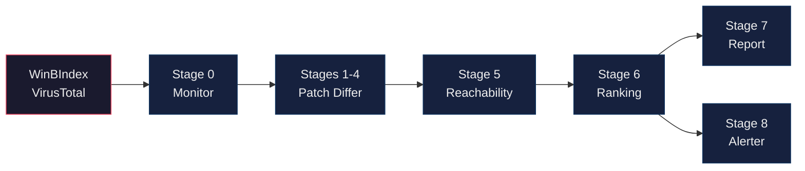

<h1 align="center">Ahmad Abdillah</h1>

  <em>Malware analyst focused on Windows kernel driver security.</em>

  
  

---

I spend most of my time reversing Windows kernel drivers and looking at how vendors patch security bugs. A lot of driver updates ship quietly with no CVE or advisory, and the interesting fixes (use-after-free, missing bounds checks, IOCTL input validation) get buried under hundreds of cosmetic changes. Reviewing a single driver update manually takes anywhere from 4 to 12 hours.

So I built a pipeline to do it automatically.

### AutoPiff Pipeline

New driver versions get picked up from WinBIndex and VirusTotal, decompiled with Ghidra, diffed against prior builds, run through 58 semantic detection rules, scored by exploitability, and the interesting ones land in Telegram.

### Projects

<table>
  <tr>
    <td><a href="https://github.com/splintersfury/AutoPiff"><b>AutoPiff</b></a></td>
    <td>The analysis engine. Semantic YAML rules (58 rules, 22 categories), Ghidra scripts for decompilation and reachability tracing, scoring framework.</td>
  </tr>
  <tr>
    <td><a href="https://github.com/splintersfury/driver_analyzer"><b>driver_analyzer</b></a></td>
    <td>Production stack that runs AutoPiff at scale. Karton + MWDB + Ghidra + MinIO, with dashboards, alerting, and driver monitoring.</td>
  </tr>
</table>

### What It Catches

| Category | Example |
|----------|---------|
| Use-After-Free | `ExFreePool` followed by `ptr = NULL` |
| Bounds Checks | Length validation before `memcpy` / `RtlCopyMemory` |
| User Boundary | Added `ProbeForRead` / `ProbeForWrite` |
| Integer Overflow | Safe math: `RtlULongAdd`, `RtlSizeTMult` |
| Race Conditions | Interlocked ops, lock acquisition changes |
| IOCTL Hardening | New input validation in dispatch handlers |
| Pool Corruption | Pool tag/type changes, NX pool migration |
| Privilege Checks | `SeSinglePrivilegeCheck` / token validation added |

### Tech

| | |
|---|---|
| **Analysis** | Python, Ghidra (headless), YAML rule engine, jsonschema |
| **Infrastructure** | Karton, MWDB Core, Redis, RabbitMQ, MinIO, Docker Compose |
| **RE Tooling** | IDA Pro, Ghidra, WinDbg, x64dbg |

---

  <a href="https://threatunpacked.com">threatunpacked.com</a>

